# Rapport d'Analyse - Système de Support par RAG

## Vue d'ensemble

Ce programme Go implémente un système intelligent de gestion de tickets de support utilisant la technologie **RAG (Retrieval-Augmented Generation)** combinée à des **agents IA spécialisés** pour l'extraction, la recherche d'informations et la génération de rapports.

Le système permet de :
- Indexer automatiquement des tickets de support et des rapports de solution au format Markdown
- Rechercher des tickets similaires via des questions en langage naturel
- Extraire automatiquement les métadonnées, numéros de tickets et mots-clés
- Générer des rapports synthétiques sur les tickets similaires
- Rechercher et présenter des solutions basées sur des rapports existants

## Fonctionnalités principales

### 1. Indexation Intelligente des Tickets

Le système charge et indexe automatiquement les fichiers de tickets (format Markdown) depuis le répertoire `./data/tickets`. Pour chaque ticket :

- **Extraction automatique** du numéro de ticket depuis le nom du fichier
- **Génération de métadonnées enrichies** via agent IA :
  - Titre du ticket
  - Mots-clés pertinents (maximum 3)
  - Description courte
  - Détection automatique de la langue
- **Création d'embeddings vectoriels** pour la recherche sémantique
- **Persistance dans un store local** (`./store/ticket_embeddings.json`) pour accélérer les démarrages futurs

### 2. Indexation Intelligente des Rapports de Solution

Le système charge et indexe automatiquement les rapports de solution depuis le répertoire `./data/reports`. Pour chaque rapport :

- **Extraction automatique de métadonnées enrichies** via agent IA :
  - Titre du rapport
  - Résumé du rapport
  - Numéros de tickets résolus
  - Mots-clés pertinents
  - Description courte
  - Sujet principal
- **Découpage en chunks** : Les rapports (qui peuvent être très longs) sont divisés en morceaux de 768 caractères avec 128 caractères de chevauchement
- **Création d'embeddings vectoriels** pour chaque chunk
- **Persistance dans un store local** (`./store/report_embeddings.json`)

### 3. Recherche par Similarité Sémantique

L'utilisateur peut poser des questions en langage naturel. Le système :

- Convertit la question en **embedding vectoriel**
- Recherche les **4 tickets les plus similaires** dans le store des tickets
- Applique un **seuil de pertinence de 0.6** pour filtrer les résultats
- Affiche les résultats avec leur **score de similarité** (0 à 1)

### 4. Extraction Automatique des Numéros de Tickets et Mots-Clés

À partir des résultats de recherche, un **agent spécialisé** analyse le contenu et extrait automatiquement :
- Tous les **numéros de tickets** mentionnés
- Les **mots-clés** pertinents

Ces informations sont ensuite utilisées pour rechercher des solutions dans les rapports.

### 5. Génération de Rapports sur les Tickets Similaires

Un agent de type **chat** génère un rapport synthétique sur les tickets similaires trouvés :
- Analyse les tickets similaires
- Produit un résumé structuré en streaming
- Utilise des templates de messages personnalisés

### 6. Recherche et Génération de Rapports de Solutions

Le système recherche des solutions dans les rapports indexés :
- Combine les numéros de tickets et mots-clés extraits
- Recherche les **6 rapports les plus pertinents** (seuil 0.6)
- Génère un rapport de solution final en streaming
- Présente les solutions existantes pour les problèmes similaires

## Architecture Technique

### Configuration et Variables d'Environnement

Le système utilise les variables d'environnement suivantes (définies dans `.env`) :

| Variable | Valeur par défaut | Description |
|----------|-------------------|-------------|
| `ENGINE_URL` | `http://localhost:11434/v1` | URL du moteur LLM (compatible OpenAI API) |
| `DATA_EXTRACTOR_MODEL` | `hf.co/menlo/jan-nano-gguf:q4_k_m` | Modèle pour l'extraction de métadonnées |
| `RAG_MODEL` | `huggingface.co/mixedbread-ai/mxbai-embed-large-v1:f16` | Modèle d'embeddings pour le RAG |
| `REPORTER_MODEL` | `hf.co/menlo/lucy-gguf:q4_k_m` | Modèle pour la génération de rapports |
| `STORE_PATH_TICKETS` | `./store/ticket_embeddings.json` | Chemin du store d'embeddings des tickets |
| `STORE_PATH_REPORTS` | `./store/report_embeddings.json` | Chemin du store d'embeddings des rapports |
| `RAG_PATH_TICKETS` | `./data/tickets` | Répertoire source des tickets |
| `RAG_PATH_REPORTS` | `./data/reports` | Répertoire source des rapports |

**Fichiers de configuration** :
- `ticket.data.extraction.instructions.md` : Instructions pour l'extraction de métadonnées des tickets
- `report.data.extraction.instructions.md` : Instructions pour l'extraction de métadonnées des rapports
- `ticket.numbers.extraction.instructions.md` : Instructions pour l'extraction des numéros de tickets
- `ticket.report.instructions.md` : Instructions pour la génération de rapports sur les tickets
- `ticket.report.user.message.md` : Template de message utilisateur pour les rapports de tickets
- `solution.report.instructions.md` : Instructions pour la génération de rapports de solutions
- `solution.report.user.message.md` : Template de message utilisateur pour les rapports de solutions

### Types de données

#### TicketMetadata
Structure contenant les métadonnées enrichies d'un ticket :
```go
type TicketMetadata struct {
    Number           string   // Numéro du ticket (ex: "089")
    Title            string   // Titre du ticket
    Keywords         []string // Maximum 3 mots-clés
    ShortDescription string   // Description courte
    Language         string   // Langue du ticket
}
```

#### Tickets
Structure pour l'extraction de numéros de tickets et mots-clés :
```go
type Tickets struct {
    Numbers  []string // Liste des numéros de tickets extraits
    Keywords []string // Liste des mots-clés extraits
}
```

#### ReportMetaData
Structure contenant les métadonnées enrichies d'un rapport de solution :
```go
type ReportMetaData struct {
    ReportTitle           string   // Titre du rapport
    ReportSummary         string   // Résumé concis du rapport
    ResolvedTicketNumbers []string // Numéros de tickets résolus
    Keywords              []string // Mots-clés associés
    ShortDescription      string   // Description courte
    MainTopic             string   // Sujet principal
}
```

## Workflows

### Workflow général du programme


### Workflow de traitement d'une question


## Architecture des Agents

```mermaid
classDiagram
    class TicketMetaDataExtractorAgent {
        +Name: "ticket-data-extractor-agent"
        +Type: Structured Agent
        +Model: jan-nano-gguf:q4_k_m
        +Output: TicketMetadata
        +KeepConversationHistory: false
        +GenerateStructuredData(messages) TicketMetadata
    }

    class ReportMetaDataExtractorAgent {
        +Name: "report-data-extractor-agent"
        +Type: Structured Agent
        +Model: jan-nano-gguf:q4_k_m
        +Output: ReportMetaData
        +KeepConversationHistory: false
        +GenerateStructuredData(messages) ReportMetaData
    }

    class TicketNumbersExtractorAgent {
        +Name: "ticket-numbers-extractor-agent"
        +Type: Structured Agent
        +Model: jan-nano-gguf:q4_k_m
        +Output: Tickets
        +KeepConversationHistory: false
        +GenerateStructuredData(messages) Tickets
    }

    class RAGTicketsAgent {
        +Name: "rag-tickets-agent"
        +Type: RAG Agent
        +Model: mxbai-embed-large-v1:f16
        +StoreFileExists(path) bool
        +LoadStore(path) error
        +SaveEmbedding(content) error
        +SearchTopN(query, threshold, n) Similarities
        +PersistStore(path) error
    }

    class RAGReportsAgent {
        +Name: "rag-reports-agent"
        +Type: RAG Agent
        +Model: mxbai-embed-large-v1:f16
        +StoreFileExists(path) bool
        +LoadStore(path) error
        +SaveEmbedding(content) error
        +SearchTopN(query, threshold, n) Similarities
        +PersistStore(path) error
    }

    class TicketsReporterAgent {
        +Name: "ticket-reporter-agent"
        +Type: Chat Agent
        +Model: lucy-gguf:q4_k_m
        +Temperature: 0.8
        +KeepConversationHistory: false
        +GenerateStreamCompletion(messages, callback) string
    }

    class SolutionReporterAgent {
        +Name: "solution-reporter-agent"
        +Type: Chat Agent
        +Model: lucy-gguf:q4_k_m
        +Temperature: 0.8
        +KeepConversationHistory: false
        +GenerateStreamCompletion(messages, callback) string
    }

    class TicketMetadata {
        +Number: string
        +Title: string
        +Keywords: []string
        +ShortDescription: string
        +Language: string
    }

    class ReportMetaData {
        +ReportTitle: string
        +ReportSummary: string
        +ResolvedTicketNumbers: []string
        +Keywords: []string
        +ShortDescription: string
        +MainTopic: string
    }

    class Tickets {
        +Numbers: []string
        +Keywords: []string
    }

    TicketMetaDataExtractorAgent --> TicketMetadata: génère
    ReportMetaDataExtractorAgent --> ReportMetaData: génère
    TicketNumbersExtractorAgent --> Tickets: génère
    RAGTicketsAgent --> TicketMetadata: utilise pour enrichissement
    RAGReportsAgent --> ReportMetaData: utilise pour enrichissement
```



## Détails des agents

### 1. Ticket MetaData Extractor Agent
**Rôle** : Extraction de métadonnées structurées depuis le contenu d'un ticket

**Configuration** :
- Type : Structured Agent
- Modèle : `jan-nano-gguf:q4_k_m`
- `KeepConversationHistory: false` (pas de mémorisation entre les appels)

**Instructions système** :
- Chargées depuis `ticket.data.extraction.instructions.md`
- Extraire les métadonnées au format JSON
- Identifier la langue du ticket

**Utilisation** : Phase d'indexation des tickets uniquement

### 2. Report MetaData Extractor Agent
**Rôle** : Extraction de métadonnées structurées depuis le contenu d'un rapport de solution

**Configuration** :
- Type : Structured Agent
- Modèle : `jan-nano-gguf:q4_k_m`
- `KeepConversationHistory: false` (pas de mémorisation entre les appels)

**Instructions système** :
- Chargées depuis `report.data.extraction.instructions.md`
- Extraire titre, résumé, numéros de tickets résolus, mots-clés, description et sujet principal
- Format de sortie JSON

**Utilisation** : Phase d'indexation des rapports uniquement

### 3. Ticket Numbers Extractor Agent
**Rôle** : Extraction des numéros de tickets et mots-clés mentionnés dans un texte

**Configuration** :
- Type : Structured Agent
- Modèle : `jan-nano-gguf:q4_k_m`
- `KeepConversationHistory: false` (pas de mémorisation entre les appels)

**Instructions système** :
- Chargées depuis `ticket.numbers.extraction.instructions.md`
- Extraire tous les numéros de tickets mentionnés
- Extraire les mots-clés pertinents
- Format de sortie JSON

**Utilisation** : Phase de recherche, après obtention des similarités de tickets

### 4. RAG Tickets Agent
**Rôle** : Gestion des embeddings et recherche par similarité sémantique pour les tickets

**Configuration** :
- Type : RAG Agent
- Modèle : `mxbai-embed-large-v1:f16` (modèle d'embeddings)
- Store : `./store/ticket_embeddings.json`

**Capacités** :
- Génération d'embeddings vectoriels
- Stockage et chargement de store persistant
- Recherche des N tickets les plus similaires
- Filtrage par seuil de similarité

**Utilisation** : Phase d'indexation et phase de recherche

### 5. RAG Reports Agent
**Rôle** : Gestion des embeddings et recherche par similarité sémantique pour les rapports

**Configuration** :
- Type : RAG Agent
- Modèle : `mxbai-embed-large-v1:f16` (modèle d'embeddings)
- Store : `./store/report_embeddings.json`

**Capacités** :
- Génération d'embeddings vectoriels pour les chunks de rapports
- Stockage et chargement de store persistant
- Recherche des N rapports les plus similaires
- Filtrage par seuil de similarité

**Utilisation** : Phase d'indexation (avec chunking) et phase de recherche

### 6. Tickets Reporter Agent
**Rôle** : Génération de rapports synthétiques sur les tickets similaires trouvés

**Configuration** :
- Type : Chat Agent
- Modèle : `lucy-gguf:q4_k_m`
- Température : 0.8 (génération créative)
- `KeepConversationHistory: false` (pas de mémorisation)

**Instructions système** :
- Chargées depuis `ticket.report.instructions.md`
- Analyser les tickets similaires
- Produire un rapport structuré et lisible

**Template de message** :
- Chargé depuis `ticket.report.user.message.md`
- Contient le contexte des tickets similaires trouvés

**Utilisation** : Phase de génération de rapport après recherche de tickets

### 7. Solution Reporter Agent
**Rôle** : Génération de rapports de solutions basés sur les rapports trouvés

**Configuration** :
- Type : Chat Agent
- Modèle : `lucy-gguf:q4_k_m`
- Température : 0.8 (génération créative)
- `KeepConversationHistory: false` (pas de mémorisation)

**Instructions système** :
- Chargées depuis `solution.report.instructions.md`
- Analyser les solutions trouvées
- Synthétiser les recommandations

**Template de message** :
- Chargé depuis `solution.report.user.message.md`
- Contient le contexte des rapports de solutions trouvés

**Utilisation** : Phase finale de génération de rapport de solutions

## Fonctions utilitaires

### ExtractTicketNumber
Extrait le numéro d'un ticket depuis son nom de fichier (retourne un entier)
```
Entrée : "data/tickets/ticket_089.md"
Sortie : 89
```

### ExtractTicketNumberStr
Extrait le numéro d'un ticket en conservant les zéros de padding (retourne une chaîne)
```
Entrée : "data/tickets/ticket_089.md"
Sortie : "089"
```

## Interface utilisateur

Le programme utilise des composants UI enrichis :
- **Spinner** : Indicateur visuel pendant les traitements avec messages contextuels
  - "loading..." : Chargement initial
  - "searching tickets..." : Recherche dans le store de tickets
  - "extracting ticket numbers..." : Extraction des numéros
  - "generating similar tickets report..." : Génération du rapport de tickets
  - "searching reports..." : Recherche dans le store de rapports
  - "generating solution report..." : Génération du rapport de solutions
- **Prompt coloré** : Interface interactive pour saisir les questions
- **Markdown streaming** : Affichage en temps réel des rapports générés avec formatage Markdown coloré
- **Affichage coloré** : Codes couleur pour différencier les types d'informations
  - Vert : Succès et résultats
  - Cyan : Contenu des tickets
  - Jaune : Scores et avertissements
  - Rouge : Erreurs
  - Violet : Métadonnées extraites

## Commandes disponibles

- **Question libre** : Poser n'importe quelle question liée aux tickets
- **/bye** : Quitter le programme

## Gestion des erreurs

Le système inclut une gestion robuste des erreurs :
- **Métadonnées vides** : Création de structures vides en cas d'échec d'extraction pour éviter les nil pointer dereference
- **Numéro par défaut** : Assignation d'un numéro "no_ticket_number" si extraction impossible depuis le nom de fichier
- **Messages d'erreur détaillés** : Affichage du contexte avec noms de fichiers et détails de l'erreur
- **Continuation du traitement** : Les erreurs individuelles n'arrêtent pas le processus global
- **Gestion du contexte** : Note dans le code sur le dépassement de contexte avec recommandations :
  - Augmenter la taille du contexte du modèle (ex: context_size: 32768)
  - Utiliser un modèle avec un contexte plus large (ex: lucy-128k-gguf)
- **Arrêt gracieux** : Le spinner s'arrête proprement en cas d'erreur

## Points Techniques Remarquables

### 1. Optimisation des Performances
- **Stores persistants** : Les embeddings sont sauvegardés sur disque pour éviter de recalculer à chaque démarrage
  - `./store/ticket_embeddings.json` pour les tickets
  - `./store/report_embeddings.json` pour les rapports
- **Chargement conditionnel** : Le système vérifie l'existence des stores avant de reindexer
- **Chunking des rapports** : Les rapports longs sont découpés en morceaux de 768 caractères avec 128 caractères de chevauchement (overlap) pour optimiser la recherche

### 2. Traitement des Documents
- **Tickets** : Traités comme documents uniques avec enrichissement de métadonnées (pas de chunking)
- **Rapports** : Découpés en chunks pour gérer les documents longs tout en préservant le contexte
- **Enrichissement intelligent** : Les métadonnées générées par IA sont intégrées aux embeddings pour améliorer la qualité de la recherche sémantique

### 3. Gestion du Contexte des Agents
- **KeepConversationHistory: false** : Tous les agents structurés et chat n'ont pas de mémorisation
- **Pas de ResetMessages()** : Les commentaires dans le code indiquent que le reset n'est pas nécessaire car les agents ne gardent pas l'état
- **Isolation des sessions** : Chaque document est analysé indépendamment

### 4. Paramètres de Recherche
- **Tickets** :
  - Seuil de similarité : **0.6**
  - Top-N : **4 résultats**
- **Rapports** :
  - Seuil de similarité : **0.6**
  - Top-N : **6 résultats** (plus de résultats car on recherche des solutions)
- **Scoring** : Les résultats sont triés par score de similarité décroissant
- **Requête combinée** : Les numéros de tickets et mots-clés sont combinés pour créer une requête enrichie ("Resolved tickets: [numéros] with keywords: [mots-clés]")

### 5. Streaming et UX
- **Génération en temps réel** : Les rapports sont générés en streaming pour une meilleure expérience utilisateur
- **Parser Markdown** : Utilisation d'un parser de chunks Markdown pour un affichage coloré en temps réel
- **Détection du premier chunk** : Le spinner s'arrête dès la réception du premier chunk de texte (finishReason == "")

### 6. Architecture Multi-Agents
- **7 agents spécialisés** : Chaque agent a un rôle précis et des instructions dédiées
- **Templates externes** : Les instructions et templates de messages sont chargés depuis des fichiers Markdown
- **Séparation des responsabilités** :
  - Agents structurés pour l'extraction
  - Agents RAG pour la recherche
  - Agents chat pour la génération de rapports

## Dépendances Principales

### Packages Go Externes
- **nova-sdk** (`github.com/snipwise/nova/nova-sdk`) : Framework d'agents IA et RAG
  - `agents` : Configuration des agents
  - `agents/structured` : Agents pour extraction structurée
  - `agents/rag` : Agents pour recherche par similarité
  - `agents/rag/chunks` : Découpage de texte en chunks
  - `agents/chat` : Agents conversationnels pour génération de rapports
  - `messages` et `messages/roles` : Gestion des messages et rôles
  - `models` : Configuration des modèles LLM
  - `toolbox/env` : Gestion des variables d'environnement
  - `toolbox/files` : Utilitaires de lecture/écriture de fichiers
  - `ui/display` : Affichage formaté et coloré avec support Markdown
  - `ui/prompt` : Interface de saisie interactive
  - `ui/spinner` : Indicateurs de progression animés

### Composants Internes
- **Types de structures** :
  - `TicketMetadata` : Métadonnées des tickets
  - `ReportMetaData` : Métadonnées des rapports
  - `Tickets` : Numéros et mots-clés extraits
- **Fonctions utilitaires** :
  - `ExtractTicketNumber()` : Extraction du numéro en int
  - `ExtractTicketNumberStr()` : Extraction du numéro en string avec padding
  - `Truncate100()` : Tronquer à 100 caractères pour l'affichage
- **Fonctions de création d'agents** :
  - `GetTicketMetaDataExtractorAgent()`
  - `GetReportMetaDataExtractorAgent()`
  - `GetTicketNumbersExtractorAgent()`
  - `GetRagTicketsAgent()`
  - `GetRagReportsAgent()`
  - `GetTicketsReporterAgent()`
  - `GetSolutionReportsReporterAgent()`
- **Fonctions de création de stores** :
  - `CreateTicketsStoreWithVectors()`
  - `CreateReportsStoreWithVectors()`

## Améliorations Possibles

### Fonctionnalités Utilisateur
1. **Interface web** : Créer une interface web moderne pour faciliter l'utilisation
2. **Support multi-langues** : Permettre les questions dans différentes langues
3. **Historique des conversations** : Sauvegarder et rejouer les sessions précédentes
4. **Export des résultats** : Exporter les recherches et rapports en JSON, CSV ou PDF
5. **Feedback utilisateur** : Permettre de noter la pertinence des solutions proposées

### Optimisations Techniques
6. **Configuration dynamique** : Permettre l'ajustement en temps réel des seuils de similarité et du nombre de résultats
7. **Mise à jour incrémentale** : Ajouter de nouveaux tickets/rapports au store sans tout recalculer
8. **Caching intelligent** : Mise en cache des requêtes fréquentes et des embeddings
9. **Optimisation des requêtes** : Tester différentes formulations de requêtes pour améliorer la pertinence (voir TODO ligne 245 du main.go)
10. **Gestion des cas sans ticket** : Améliorer la recherche quand aucun numéro de ticket n'est extrait (voir QUESTION ligne 246 du main.go)

### Fonctionnalités Avancées
11. **Regroupement automatique** : Détecter et grouper les tickets similaires automatiquement
12. **Analyse de tendances** : Identifier les problèmes récurrents dans les tickets
13. **Suggestions automatiques** : Proposer des questions pertinentes basées sur le contenu
14. **API REST** : Exposer les fonctionnalités via une API pour intégration externe
15. **Notifications** : Alerter quand de nouveaux rapports correspondent à des tickets ouverts
16. **Modèles alternatifs** : Support de différents modèles LLM selon la complexité (ex: utiliser un modèle plus grand pour les rapports complexes - voir ligne 28 et 74 du main.go)

### Workflow Alternatif
17. **Recherche par passage unique** : Essayer la combinaison de tous les numéros de tickets en une seule requête au lieu de boucler (voir commentaire ligne 230 du main.go)
18. **Réindexation sélective** : Permettre de réindexer seulement les tickets/rapports modifiés

## Résumé du Flux de Traitement Complet

Lorsqu'un utilisateur pose une question sur un problème technique :

1. **Phase 1 - Recherche de tickets similaires** :
   - Le système convertit la question en embedding vectoriel
   - Recherche les 4 tickets les plus similaires (seuil 0.6)
   - Affiche les tickets trouvés avec leurs scores

2. **Phase 2 - Extraction et rapport sur les tickets** :
   - Extrait les numéros de tickets et mots-clés du contexte
   - Génère un rapport synthétique des tickets similaires en streaming
   - Affiche le rapport en Markdown coloré

3. **Phase 3 - Recherche de solutions** :
   - Combine les numéros de tickets et mots-clés en une requête
   - Recherche les 6 rapports de solution les plus pertinents (seuil 0.6)
   - Affiche les rapports trouvés

4. **Phase 4 - Génération du rapport de solutions** :
   - Analyse les solutions trouvées dans les rapports
   - Génère un rapport de solutions final en streaming
   - Présente les recommandations à l'utilisateur

Le système offre ainsi une assistance complète : de l'identification de problèmes similaires à la présentation de solutions éprouvées, le tout de manière automatisée et intelligente.

---

**Dernière mise à jour** : Décembre 2025
**Version** : 2.0
**Type de système** : Système intelligent de support technique par RAG multi-agents
